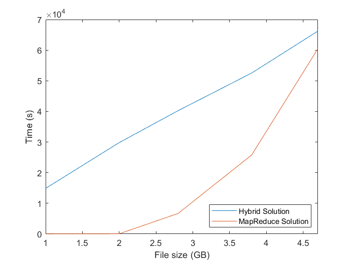

# A PERFORMANCE EVALUATION OF TWO EQUI-JOIN MODELS FOR PROCESSING BIG DATA

This repository contains two solutions for implementing an equi-join for processing big data. Both solutions were written in C++. 
The Hybrid solution makes use of MPI and OpenMP. The MapReduce Solution uses Phoenix++ to implement the solution. The peformance of the two solutions were benchmarked and compared in the Group 11 ELEN4020 Project Report pdf document.

## Comparison of the two solutions over various file sizes

## Branches:
### Documentation:    Contains the .tex and .pdf files of our report for our project.

### Master:        Contains content of merged branches in relevant folders:

Hybrid Solution: Contains the code for the MPI-OpenMP Hybrid solution.

MapReduce Solution: Contains the code and the required libraries and header files for the MapReduce solution.

Documentation: All documentation related files, including the project report

Test Input: Contains two test files for running the solutions

### Compilation and Execution Instructions:
#### Hybrid Solution:
   
   To compile: 
   
   `make mpi-proj`
      
   To run: 
   
   `mpirun --hostfile [name of hostfile] -np [number of processes] ./Project [input file 1] [input file 2] [column containing key]`
      
   OR
      
   `mpiexec -n [number of processes] -f [name of hostfile] ./Project [input file 1] [input file 2] [column containing key]`
      
#### MapReduce Solution:
   
   To compile and run: 
   
   `./MapReduce.sh [input file 1] [input file 2] [column containing key]`    
